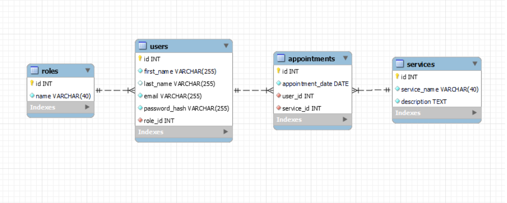

# Tattoo Studio API :pen:

This is the 4th project of the GeeksHubs Academy Fullstack Developer Bootcamp, showcasing a real-world backend development skills with TypeScript and MYSQL.
The projetc consists in develop the backend for the appointment management system of a tattoo studio.
***
## Table of Contents :file_folder:

- [Stack 🔧](#stack-wrench)
- [features 🌟](#features-star2)
- [Live Deployment 📡](#live-deployment-satellite)
- [Installation 🚀](#installation-rocket)
- [API Documentation 📑](#api-documentation-bookmark_tabs)
    - [Database Design 📰](#database-design-newspaper)
    - [Relationships ♻️](#relationships-recycle)
    - [Indices and Constraints ➡️](#indices-and-constraints-arrow_right)
    - [Endpoints 🔌](#endpoints-electric_plug)
- [Author ✒️](#author-black_nib)
- [Next versions 🔜](#next-versions-soon)
- [Acknowledgements 🎓](#acknowledgements-mortar_board)

***
## Stack :wrench:
<div align="center">


 </div>

***
## FEATURES :star2:

- **Endpoints test:** Thunder collection file. [Open it in Thunder client extension and test de APP ](./HTTP/thunder-collection_PROJETC_4.json)👌
- **User Authentication:** Secure signup and login processes. 🔒
- **Appointment Creation:** Users can book appointments, with date and user profile validation. 📅
- **Admin and SuperAdmin CRUD Endpoints:** Full control over users, appointments and services for administrators. 👩‍💼👨‍💼
- **Acurate Documentation:** Fully documented API endpoints. 📚
- **Docker Container:** Easy setup and deployment with Docker. 🐳
- **MySQL Database with TypeORM and Migrations:** Robust database management. 🗄️
- **Mock Data Generation:** Realistic data generation with Faker.js. 🤖
- **JWT Authentication:** Secure API endpoints with JSON Web Tokens. 🔑
- **Error Handling:** Custom error middleware for handling common API errors. 📝

***
## Live Deployment :satellite:

Try out the API at: https://fsd-project-4-backend-1-dev-tmen.3.us-1.fl0.io/api/services


***
## Installation :rocket:
- #### GitHub 🐾
  - Get a copy of the project up and running on your local machine:

    ```sh
    git clone https://github.com/Ferelbue/FSD-PROJECT-4-BACKEND-1.git
    ```

- #### Docker 🐳
  - You'll need Docker installed on your machine:
    ```sh
    $ docker run --name nombre-contenedor -p 3307:3306 -e MYSQL_ROOT_PASSWORD=1234 -d mysql
    ```

- #### MySQL Workbench 🔧
  - Create and run a new server conection with the port, user and passwors establised.

- #### Node 📟
  - Run directly with Node: 
    ```sh
    npm install             # Install dependecies
    npm run migration-run  # Run migrations
    npm run seed            # Poblate DB with mock
    npm run dev             # Run server
    ```

    ⚠️You'll need add a `.env` based on the provided `.env.example` file with the database credentials⚠️

***
## API Documentation :bookmark_tabs:

  - ### Database Design :newspaper:



***
  - ### Relationships :recycle:
    - `Role` to `Users`: One-to-many relationship where:
      - One role can have many users.

    - `User` to `Appointments`: One-to-many relationship where:
      - One user can have many appointments.

    - `Service` to `Appointments`: One-to-many relationship where:
      - One service can have many appointments.
***
  - ### Indices and Constraints :arrow_right:

    - `Users` table:
      - Unique constraint on `email` to ensure each user has an unique email address.
      - Foreign key constraint on `role_id` referring to `id` in the `Roles` table.
    - `Appointments` table:
      - Foreign key constraint on `service_id` and `user_id` referring to `id` in the `Users` and `Services` tables.

***
  - ### Endpoints :electric_plug:

  (Click to expand)


<details>
  <summary style="font-weight: bold; font-size: 1.3em;">User Endpoints</summary>
  
##### Public 🌍

- `GET /api/services` - List all tattoo services.
    <details>
      <summary style="font-weight: bold; font-size: 0.8em;">FEATURES</summary>
        - Anyone with an internet connection can visit the studio's services.
    </details>

##### Authentication 🔒

- `POST /api/auth/register` - Register a new user.
    <details>
      <summary style="font-weight: bold; font-size: 0.8em;">FEATURES</summary>
        - Forbidden to repeat an email address already registered. <br>- Last name not mandatory. 
    </details>
    <details>
      <summary style="font-weight: bold; font-size: 0.8em;">BODY</summary>

        {
          "firstName": "Pepe",
          "lastName": "Perez",
          "email": "pepe@pepe.com",
          "password": "123456"
        }
        
    </details>
- `POST /api/auth/login` - Login an existing user.
    <details>
      <summary style="font-weight: bold; font-size: 0.8em;">FEATURES</summary>
        - Mandatory to be already registered in the aplication.<br>
        - Mandatory to introduce the email and password successfully.
    </details>
    <details>
      <summary style="font-weight: bold; font-size: 0.8em;">BODY</summary>

        {
          "email": "pepe@pepe.com",
          "password": "123456"
        }
        
    </details>
##### Users 👤

- `GET /api/users` - Retrieve authenticated user's profile.
    <details>
      <summary style="font-weight: bold; font-size: 0.8em;">FEATURES</summary>
        - Mandatory to be logged previusly.<br>
        - Forbiden to see others profiles.
    </details>
    <details>
      <summary style="font-weight: bold; font-size: 0.8em;">TOKEN</summary>
        - Mandatory to send the token in the Bearer Authentication.
    </details>
- `PUT /api/users/profile` - Update authenticated user's profile.
    <details>
      <summary style="font-weight: bold; font-size: 0.8em;">FEATURES</summary>
        - Mandatory to be logged previusly.<br>
        - Forbiden to update others profiles.<br>
        - The user can modify whatever he wants (name, last name, email or password). At the same time or separately.<br>
        - To modify the password had to write two passwords.
    </details>
    <details>
      <summary style="font-weight: bold; font-size: 0.8em;">TOKEN</summary>
        Mandatory to send the token in the Bearer Authentication.
    </details>
        <details>
      <summary style="font-weight: bold; font-size: 0.8em;">BODY</summary>

        { THIS IS AN EXAMPLE. CAN BE MODIFIED SEPARATELY
          "firstName": "Pepe",
          "lastName": "Perez",
          "email": "pepe@pepe.com",

          "password": "123456",
          "newPassword": "654321"
        }

    </details>

##### Appointments 📅

- `GET /api/appointments` - Retrieve user's appointments.
    <details>
      <summary style="font-weight: bold; font-size: 0.8em;">FEATURES</summary>
        - Mandatory to be logged previusly.<br>
        - Forbiden to see other users appointments.
    </details>
    <details>
      <summary style="font-weight: bold; font-size: 0.8em;">TOKEN</summary>
        Mandatory to send the token in the Bearer Authentication.
    </details>

- `GET /api/appointments/{id}` - Retrieve details of a specific appointment.
    <details>
      <summary style="font-weight: bold; font-size: 0.8em;">FEATURES</summary>
        - Mandatory to send the appointment ID in the endpoint.<br>  - Forbiden to see other users appointments.
    </details>
    <details>    
    <summary style="font-weight: bold; font-size: 0.8em;">TOKEN</summary>
        Mandatory to send the token in the Bearer Authentication.
    </details>

- `PUT /api/appointments` - Update a appointment.
    <details>
      <summary style="font-weight: bold; font-size: 0.8em;">FEATURES</summary>
        - Mandatory to be logged previusly.<br> 
        - Forbiden to update other users appointments.<br> 
        - Mandatory to know the appointmentId to modify.
    </details>
    <details>
      <summary style="font-weight: bold; font-size: 0.8em;">TOKEN</summary>
        Mandatory to send the token in the Bearer Authentication.
    </details>
    <details>
      <summary style="font-weight: bold; font-size: 0.8em;">BODY</summary>

        {
          "appointmentIdToModify": 16,
          "newAppointmentDate": "2025-03-02",
          "newService": {
                  "id": 5
          }
        }

    </details>
</details>


<details>
<summary style="font-weight: bold; font-size: 1.3em;">Admin endpoints</summary>

##### Users 👩‍💼👨‍💼

- `GET /api/users` - List all users.
    <details>
      <summary style="font-weight: bold; font-size: 0.8em;">FEATURES</summary>
        - Mandatory to be logged previusly and be admin or super-admin.<br>
        - It is possible to filter by email, name or lastname adding to the endpoint: <br>
        /api/users + (?email=name@name.com)(can be only a character)
        /api/users + (?name=name)(can be only a character)

    </details>
    <details>
      <summary style="font-weight: bold; font-size: 0.8em;">TOKEN</summary>
        Mandatory to send the token in the Bearer Authentication.
    </details>

- `GET /api/users/profile` - Retrieve any user profile.
    <details>
      <summary style="font-weight: bold; font-size: 0.8em;">FEATURES</summary>
        - Mandatory to be logged previusly and be admin or super-admin.<br>
        - Mandatory to send the user ID in the endpoint.
    </details>
    <details>
      <summary style="font-weight: bold; font-size: 0.8em;">TOKEN</summary>
        Mandatory to send the token in the Bearer Authentication.
    </details>
       
- `PUT /api/users/:id/role` - Update user role.
    <details>
      <summary style="font-weight: bold; font-size: 0.8em;">FEATURES</summary>
        - Mandatory to be logged previusly and be admin or super-admin.<br>
        - Mandatory to send the user ID in the endpoint.
    </details>
    <details>
      <summary style="font-weight: bold; font-size: 0.8em;">TOKEN</summary>
        Mandatory to send the token in the Bearer Authentication.
    </details>
    <details>
      <summary style="font-weight: bold; font-size: 0.8em;">BODY</summary>

      {
        "role": "2"
      } 

- `DELETE /api/users/{id}` - Delete a user by ID.
    <details>
      <summary style="font-weight: bold; font-size: 0.8em;">FEATURES</summary>
        - Mandatory to be logged previusly and be admin or super-admin.<br>
        - Mandatory to send the user ID in the endpoint.
    </details>
    <details>
      <summary style="font-weight: bold; font-size: 0.8em;">TOKEN</summary>
        Mandatory to send the token in the Bearer Authentication.
    </details>


##### Appointments 📅

- `POST /api/appointments` - Create a new appointment.
    <details>
      <summary style="font-weight: bold; font-size: 0.8em;">FEATURES</summary>
        - Mandatory to be logged previusly and be admin or super-admin.
    </details>
    <details>
      <summary style="font-weight: bold; font-size: 0.8em;">TOKEN</summary>
        Mandatory to send the token in the Bearer Authentication.
    </details>
    <details>
      <summary style="font-weight: bold; font-size: 0.8em;">BODY</summary>

    {
      "appointmentDate": "2024-03-03",
      "user": {
              "id": 5
              },
      "service": {
              "id": 3
      }
    }
        
    </details>

- `PUT /api/appointments` - Update a appointment.
    <details>
      <summary style="font-weight: bold; font-size: 0.8em;">FEATURES</summary>
        - Mandatory to be logged previusly and be admin or super-admin.<br>
        - Admin or super-admin modifycate any appointment.
    </details>
    <details>
      <summary style="font-weight: bold; font-size: 0.8em;">TOKEN</summary>
        Mandatory to send the token in the Bearer Authentication.
    </details>
    <details>
      <summary style="font-weight: bold; font-size: 0.8em;">BODY</summary>

        {
          "appointmentIdToModify": 16,
          "newAppointmentDate": "2025-03-02",
          "newService": {
                  "id": 5
          }
        }

    </details>


##### Services 🎨

- `POST /api/services` - Create a new service.
    <details>
      <summary style="font-weight: bold; font-size: 0.8em;">FEATURES</summary>
        - Mandatory to be logged previusly and be super-admin.
    </details>
    <details>
      <summary style="font-weight: bold; font-size: 0.8em;">TOKEN</summary>
        Mandatory to send the token in the Bearer Authentication.
    </details>
    <details>
      <summary style="font-weight: bold; font-size: 0.8em;">BODY</summary>

        {
          "serviceName": "SERVICENAME",
          "description": "SERVICETEXT"
        }

    </details>
- `PUT /api/services/{id}` - Update a service by ID.
    <details>
      <summary style="font-weight: bold; font-size: 0.8em;">FEATURES</summary>
        - Mandatory to be logged previusly and be super-admin.
    </details>
    <details>
      <summary style="font-weight: bold; font-size: 0.8em;">TOKEN</summary>
        Mandatory to send the token in the Bearer Authentication.
    </details>
    <details>
      <summary style="font-weight: bold; font-size: 0.8em;">BODY</summary>

        {
          "serviceName": "SERVICENAME",
          "description": "SERVICETEXT"
        }
        
    </details>
- `DELETE /api/services/{id}` - Delete a service by ID.
    <details>
      <summary style="font-weight: bold; font-size: 0.8em;">FEATURES</summary>
        - Mandatory to be logged previusly and be super-admin.
    </details>
    <details>
      <summary style="font-weight: bold; font-size: 0.8em;">TOKEN</summary>
        Mandatory to send the token in the Bearer Authentication.
    </details>
</details>

***
## Next versions :soon:

- **Add a frontend** - So users can interact with the API from a web browser.
- **Add notifications** - So users know when their appointments are modified, created or deleted.
***
## Author :black_nib:
- **Fernando Elegido** - Full Stack Developer

<div align="center">
<a href="https://github.com/ferelbue" target="_blank"></a> 
<a href = "mailto:ferelbue@gmail.com"></a>
<a href="https://www.linkedin.com/in/fernando-elegido" target="_blank"></a> 
</div>


***

## Acknowledgements :mortar_board:

- Great appreciation to **Geekshubs Academy** for the opportunity to learn and grow as a developer.

***

[Top of document](#tattoo-studio-api-pen)